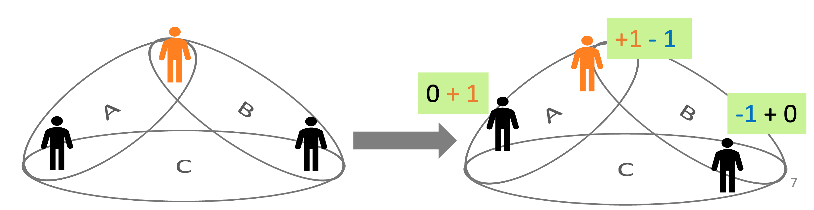

# ICG(InterRole Conflict Game)

役割間葛藤(InterRole Conflict)をマルチエージェントシミュレーションを用いて分析するために作成したプログラムである.

## 役割間葛藤(IC)とは

複数の役割(仕事、家庭など)を持つが故に板挟みに合い、複数の役割をこなすことが困難になる状態のこと.
この状況でどのように振る舞えば利益が出るのか、そのためにはどのような情報があれば良いかを調べるために役割間葛藤ゲーム(InterRole Conflict Game)を考案した.

## 役割間葛藤ゲーム(InterRole COnflict Game)

以下のルールに則りゲームが行われる.

- エージェントは2人1組の集団2個に属している
- 集団それぞれでのメンバーの重複はない
- 集団は1stepで 1 人より多い協力を集めるタスクを持つ
- エージェントは 1 stepごとに 1 つの集団に 1 回の協力しかできない
- 協力人数 S が
  - S > 1 → プラスの報酬"1"が与えられる(2人で協力)
  - S = 1 → 報酬は得られない(1人で協力)
  - S < 1 → マイナスの報酬 -1 が与えられる(0人で協力)
- エージェントの報酬は所属する 2 個の集団から得た報酬の和となる

上の図だと集団Aに2人が協力(労働)し、集団Cに1人が協力(労働)したことで左端の人から時計回りに1点、0点、-1点の報酬を得たことになる.

## エージェントの行動

エージェントは2パターンの行動リストを持っており、それぞれ"1人で対処するエージェント","他者に助けを求めるエージェント"となっている.

### 人で対処するエージェント

このエージェントの行動リストは以下のようになっている

- 現在協力している集団に留まる
- 現在協力している集団とは別の集団に切り替える

### 他者に助けを求めるエージェント

このエージェントの行動リストは以下のようになっている

- 今協力している集団の1人に協力要請する + 留まる
- 今協力している集団の1人に協力要請する + 切り替える
- 今協力していない集団の1人に協力要請する + 留まる
- 今協力していない集団の1人に協力要請する + 切り替える

## エージェントの学習モデル

過去の他者の協力状況からどの行動を取るべきかを学習・予測させるために、リカレンとニューラルネットワーク(RNN)+Q学習のモデル用いる.
